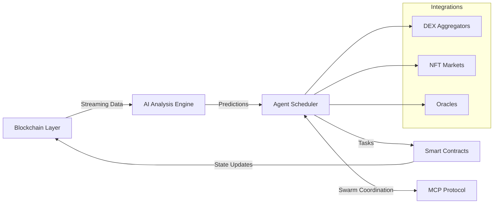
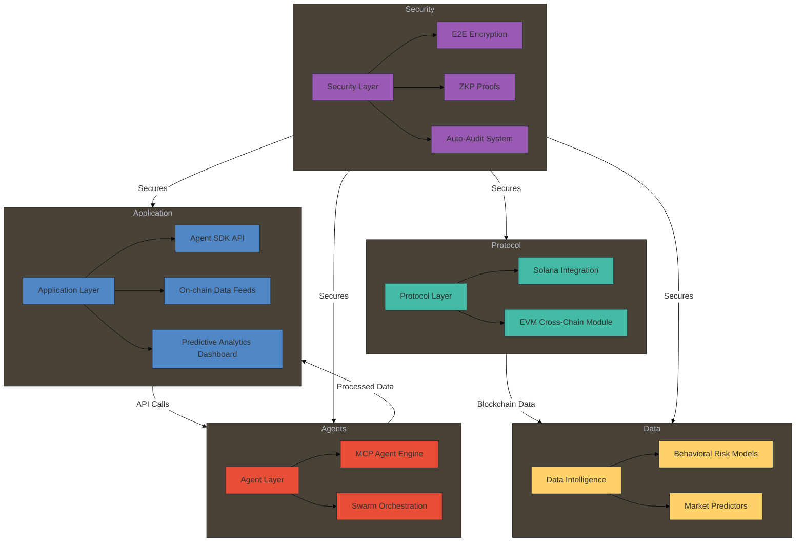
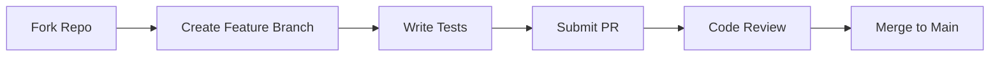

<p align="center">
  
</p>

<h1 align="center">LiquidAI - Autonomous Decentralized Intelligence Framework</h1>

<h3 align="center">Blockchain-Powered Multi-Agent AI Network for Web3 Ecosystems
CA:CGyP5or43mp5gF8eQp17QTAhWw4aT6CvXoGDckhAbonk</h3>

<div align="center">
  
[](https://opensource.org/licenses/MIT)
[](https://solana.com)
[](https://web3.foundation/)
[](https://pypi.org/project/liquidai/)
[](https://github.com/LiquidAI-FUN/LiquidAI)

</div>

<div align="center">
  <a href="https://liquid-ai.org">🌐 Website</a> •
  <a href="https://twitter.com/LiquidAI_Net">🐦 Twitter</a> •
  <a href="https://discord.gg/liquidai">📢 Discord</a> •
  <a href="#deployment-guide">🚀 Deployment</a> •
  <a href="#-contribution-guidelines">👥 Contribution</a>
</div>

---

## 📌 Overview
**Secure, Autonomous & Scalable AI for the Decentralized Future**  
LiquidAI is a blockchain-integrated multi-agent system that enables decentralized AI agents to autonomously analyze, predict, and interact with Web3 ecosystems through:

- 🧠 Real-time blockchain data processing
- 🤖 Self-optimizing agent coordination
- ⚡️ Sub-second smart contract execution
- 🔐 Zero-knowledge proof verifications

---

## 🏗 Architecture



Figure 1: LiquidAI System Architecture - Real-time Blockchain-AI-Agent Loop

## 📜 Licensing & Compliance

| Component                  | License      | Compliance Standards                          |
|----------------------------|--------------|-----------------------------------------------|
| Core Framework             | MIT          | Open Source                                   |
| AI Agent SDK               | Apache 2.0   | GDPR, CCPA Ready                              |
| Blockchain Interaction APIs| MIT          | SOC2 Type II Compatible                       |
| Smart Contract Templates   | MIT          | Audit-Ready (OpenZeppelin)                    |


## 🏗️ Technical Architecture Overview




## 🚀 Deployment Guide


System Requirements


## 🖥️ System Requirements

| Component       | Development Specification          | Production Specification               |
|-----------------|------------------------------------|----------------------------------------|
| **CPU**         | 4-Core, x86_64                    | 16-Core, x86_64 (AVX2+)               |
| **Memory**      | 8GB RAM                           | 64GB ECC RAM                          |
| **Storage**     | 100GB SSD                         | 1TB NVMe                              |
| **Node.js**     | v18+                              | v18+ (LTS)                            |
| **Python**      | 3.9+                              | 3.10+                                 |
| **GPU**         | Optional                          | NVIDIA A10G+ (CUDA 11.7)              |
| **Network**     | 100Mbps                           | 1Gbps+ (DDoS Protection)              |

<sub>🔸 *Production environment requires enabled VT-x/AMD-V virtualization*</sub>
<sub>🔸 *SSD/NVMe must support TRIM command*</sub>


Installation Steps

# 1. Clone the LiquidAI repository
```bash
git clone https://github.com/liquid-ai-project/LiquidAI.git
cd LiquidAI
```

# 2. Install core dependencies
```bash
yarn install
pip install -r requirements.txt
```

# 3. Configure environment variables
```bash
cp .env.example .env
nano .env
```

# 4. Build smart contracts (if needed)
```bash
yarn build:contracts
```
# 5. Start development server
```bash
yarn dev
```

## 🔧 Core Components
## 🧠 AI Intelligence Engine
Predictive models for DeFi, NFT, Tokenomics.

Behavioral Risk Profiling (Wallet Behavior, Anomaly Detection).

Market Sentiment Analysis.

## 🤖 Decentralized MCP Agents
Fully autonomous task delegation.

Swarm computation models.

On-chain/off-chain hybrid orchestration.

## ⛓️ Blockchain/Web3 Integrations
Solana (Native support)

Ethereum / EVM-compatible Chains

Real-time Smart Contract Interactions

Secure On-chain Trade Execution

## 🔒 Security & Compliance
End-to-end encrypted communications.

Zero Knowledge Proof (ZKP) traceability.

GDPR/CCPA-ready event logging.

## 🔥 Key Metrics

Agent Task Latency: < 900ms
Blockchain Event Sync: < 500ms
Prediction Accuracy (Test Sets): 94.5%
Smart Contract Execution Rate: 99.9% success
System Availability: 99.99% SLA

## 📖 Contribution Guidelines
Fork the repo, create feature branches, submit PRs.

Adhere to existing code conventions (Prettier, ESLint, Black).

Cover critical paths with unit & integration tests.

Respect secure development guidelines.



© 2025 LiquidAI Systems. All rights reserved.
